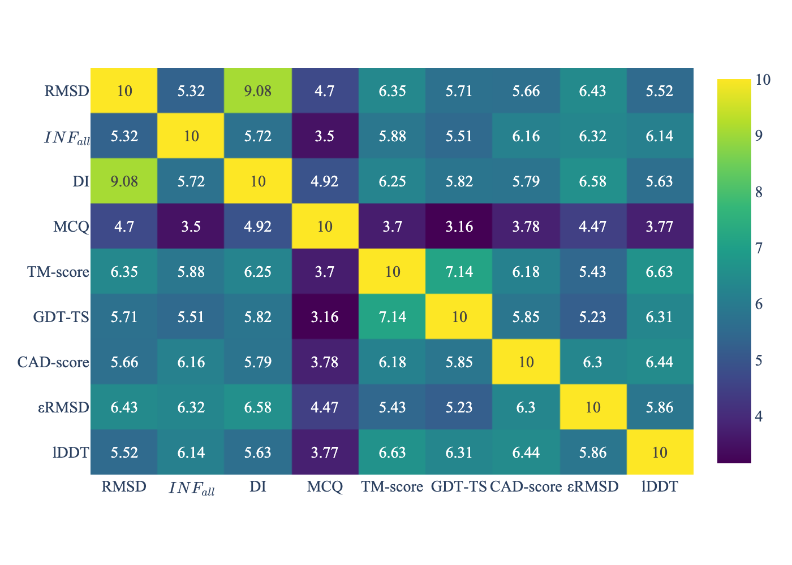
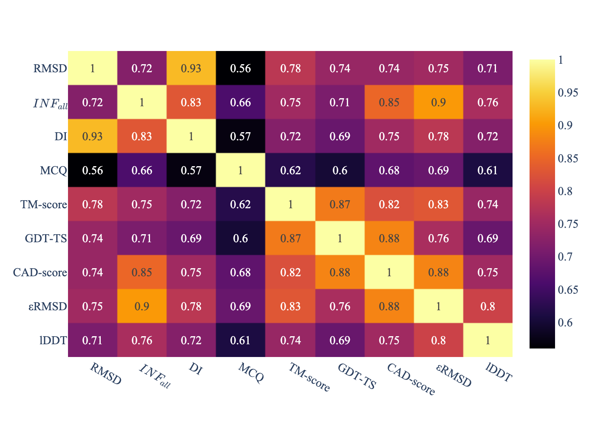
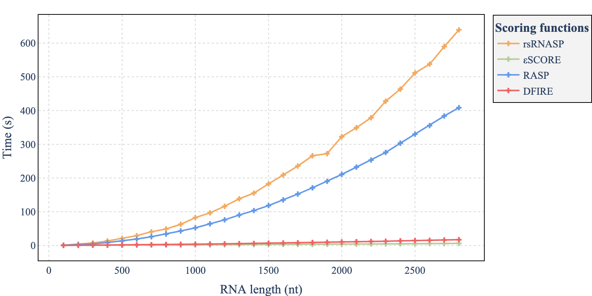
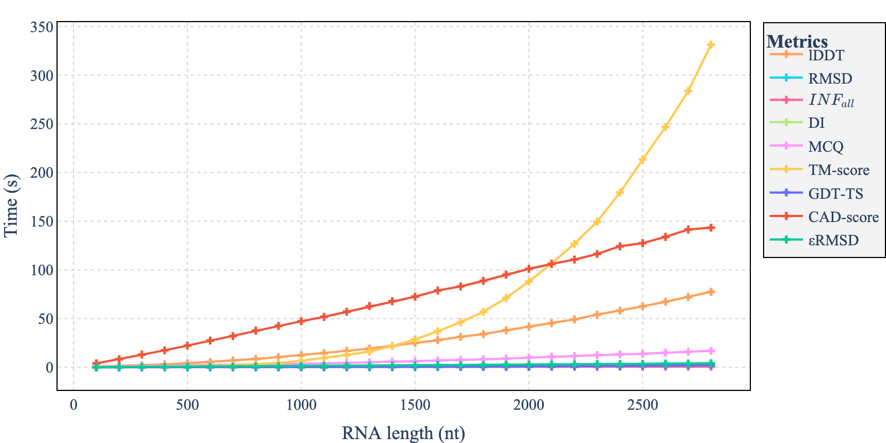
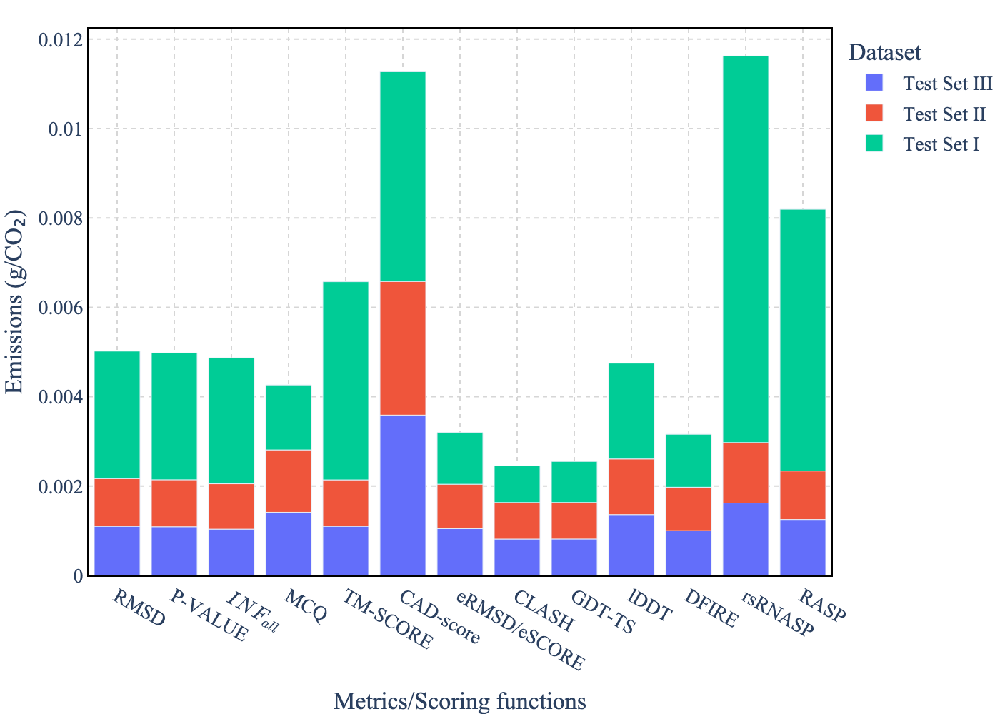
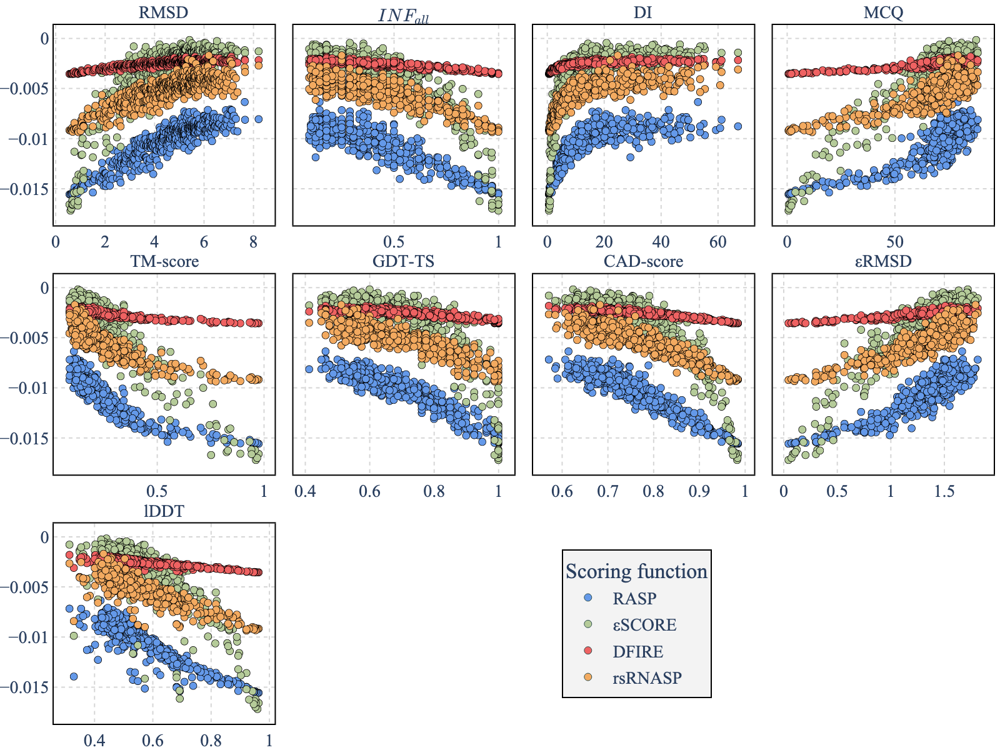

# RNA metrics and scoring functions benchmark

RNA metrics and scoring functions benchmark.
This repository contains code for the experimentations of [[RNAdvisor]](#1).

## Installations 
### 1. Datasets

Three different datasets were used. Each dataset is composed of the native structures, and the predictions (which are the decoys). 

- [Test Set I](http://melolab.org/supmat/RNApot/Sup._Data.html): it is composed of 85 RNAs with 500 decoys from [[MODELLER]](#2). 
    You can download it using: ```make install_test_set_1```
- [Test Set II](https://github.com/Tan-group/rsRNASP): it is composed of the PM decoy sets from [[rsRNASP]](#3). 
    You can download it using: ```make install_test_set_2```
- [Test Set III](https://github.com/RNA-Puzzles/standardized_dataset/tree/master): it is composed of predictions from [RNAPuzzles](http://www.rnapuzzles.org/). 
    You can download it using : ```make install_test_set_3```

You can also downlaod all the datasets using: ```make install_all_data```
Once the installations done, you should have a folder name `docker_data` with three subfolders: `TestSetI`, `TestSetII` and `TestSetIII`. 
Each subfolder should be composed of `NATIVE` and `PREDS`. 

### 2. RNAdvisor 

To compute the different metrics and scores, you should have RNAdvisor downloaded. 
It can be loader either with the [RNAdvisor](https://github.com/EvryRNA/rnadvisor/tree/main) or with dockerhub: ```docker pull sayby77/rnadvisor```.

### Python environment 
To get the different figures and to compute the CO2 equivalent emissions, you can use the python conda environment. 
To do so, use: 
```
conda create -n rna_scores_benchmark python=3.10
conda activate rna_scores_benchmark
pip install -r requirements.txt
```


## Benchmark
Once the previous installations done, you can either run the benchmark or get the results. 

### Compute metrics and scoring functions 
To recompute the scoring functions and the metrics, you can use the following command: 
```bash
make compute_scores
```
Note that the running time is very long, as TestSetI has one RNA of 2685 nucleotides. The computation time can take up to 5 days. 
We recommend use the already computed results. 

### Time benchmark 

To reproduce the computation time benchmark, you can use the following command: 
```bash
make extract_pdb_time
make benchmark_time
```

The `extract_pdb_time` command will create the different RNA decoys with different sizes. 

### Carbon benchmark

To reproduce the carbon benchmark, you can use the following command: 

```bash
make benchmark_carbon
```

## Visualisations


To get the different visualisations, you can run the command for:
- Benchmarks: `make viz`
- Computation time: `make viz_time`
- Carbon benchmark: `make viz_carbon`

The results are stored in `docker_data/plots`. 
The different scores are stored in `docker_data/scores`. 

### Metrics vs metrics 

The visualisation is available at `docker_data/plots/heatmap` with specific visualisation for each dataset.

Mean ES between metrics             |  Mean PCC between metrics
:-------------------------:|:-------------------------:
  | 

### Metrics vs scoring functions 

The scores are available at `docker_data/scores`. 

### Time benchmark

The visualisations are available at `docker_data/plots/time`

Scoring functions computation time | Metrics computation time
:-------------------------:|:-------------------------:
  | 

### Carbon benchmark

The visualisation is available at `docker_data/plots/carbon`.



### Metrics vs scoring function - example 

Here is visualisation of the logarithm of the normalized four scoring functions (RASP, εSCORE, DFIRE-RNA and rsRNASP) of RNA 1ec6D and its 500 decoys from Test
Set I depending on eight metrics. 



## References 

<a id="1">[1]</a>
RNAdvisor: a comprehensive benchmarking tool for the measure and prediction of RNA structural model quality.
Clement Bernard, Guillaume Postic, Sahar Ghannay, Fariza Tahi.
bioRxiv 2023.11.14.567018; doi: https://doi.org/10.1101/2023.11.14.567018

<a id="2">[2]</a>
Sali A, Blundell TL. Comparative protein modelling by satisfaction of spatial restraints. 
J Mol Biol. 1993 Dec 5;234(3):779-815. 
doi: 10.1006/jmbi.1993.1626. 
PMID: 8254673.

<a id="3">[3]</a>
Tan YL, Wang X, Shi YZ, Zhang W, Tan ZJ.
2022.
rsRNASP: A residue-separation-based statistical potential for RNA 3D structure
evaluation. Biophys J. 121: 142-156.

## Citation

```
RNAdvisor: a comprehensive benchmarking tool for the measure and prediction of RNA structural model quality.
Clement Bernard, Guillaume Postic, Sahar Ghannay, Fariza Tahi.
bioRxiv 2023.11.14.567018; doi: https://doi.org/10.1101/2023.11.14.567018
```
